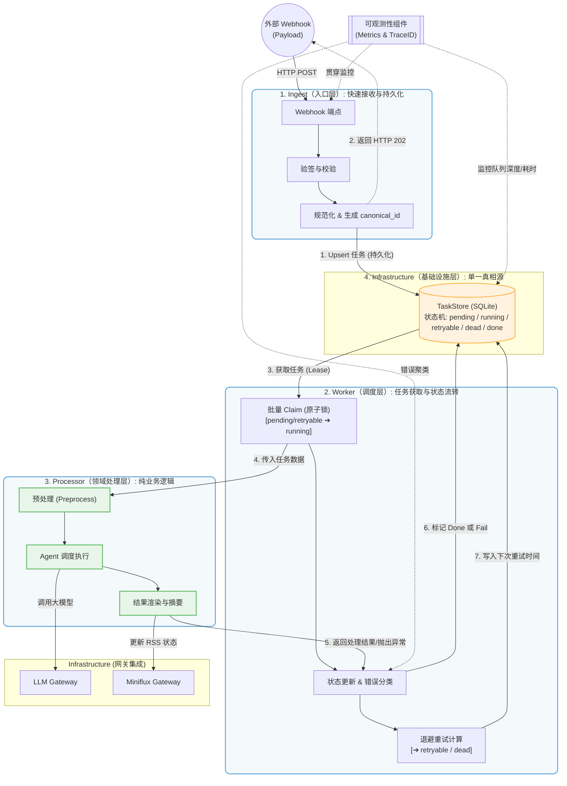

# miniflux-ai

Miniflux with AI

[中文文档](README_CN.md) | [English](README.md)

This project integrates with Miniflux to fetch RSS feed content via API or webhook. It then utilizes large language models (e.g., Ollama, ChatGPT, LLaMA, Gemini) to generate summaries, translations, and AI-driven news insights.

## Features

- **Miniflux Integration**: Seamlessly fetch unread entries from Miniflux or trigger via webhook.
- **Schedule Interval**: Specifies the time interval for requesting the miniflux api.
- **LLM Processing**: Generate summaries, translations, etc. based on your chosen LLM agent.
- **AI News**: Use the LLM agent to generate AI morning and evening news from feed content.
- **Durable Summary Archive**: Persist AI summaries to `summary_archive` before the temporary `entries` queue is cleared, enabling later analysis and backfill.
- **Flexible Configuration**: Easily modify or add new agents via the `config.yml` file.
- **Markdown and HTML Support**: Outputs in Markdown or styled HTML blocks, depending on configuration.

<table>
  <tr>
    <td>
      summaries, translations
    </td>
    <td>
      AI News
    </td>
  </tr>
  <tr>
    <td>
      <picture>
        <source media="(prefers-color-scheme: dark)" srcset="https://github.com/user-attachments/assets/11c208d9-816a-4c8c-bc00-2f780529e58d">
        <source media="(prefers-color-scheme: light)" srcset="https://github.com/user-attachments/assets/c97e2774-ec10-4acb-bef7-25cf8d43da15">
        
      </picture>
    </td>
    <td>
      <picture>
        <source media="(prefers-color-scheme: dark)" srcset="https://github.com/user-attachments/assets/b40f5bdd-d265-4beb-a14c-d39d6624760b">
        <source media="(prefers-color-scheme: light)" srcset="https://github.com/user-attachments/assets/e5985025-15f3-43b0-982b-422575962783">
        
      </picture>
    </td>
  </tr>
</table>

## Architecture



### Structure

The project uses a task-state architecture with a persistent queue and atomic task claiming:

- **Ingest layer (`app/interfaces/http/webhook_ingest.py`)**
  - Validate webhook, normalize payload, persist task, return `202` only after durable write.
- **Worker layer (`app/application/worker_service.py`)**
  - Claim tasks in batches, process with retry policy, finalize to `done/retry/dead`.
- **Processor layer (`app/domain/processor.py`)**
  - Business logic only (preprocess, agent execution, rendering, Miniflux update, summary archive persistence), no queue/state orchestration.
- **Infrastructure layer (`app/infrastructure/*`)**
  - Task store, Miniflux and LLM adapters, SQLite repositories, observability integration.

Dependency direction: `interface -> application -> domain <- infrastructure`.

For details, see [`docs/ARCHITECTURE.md`](docs/ARCHITECTURE.md).

### App Factory Integration

`create_app(...)` takes repository dependencies directly. Typical integration (SQLite, default):

```python
import threading

from app.infrastructure.ai_news_repository_sqlite import AiNewsRepositorySQLite
from app.infrastructure.entries_repository_sqlite import EntriesRepositorySQLite
from app.infrastructure.saved_entries_repository_sqlite import SavedEntriesRepositorySQLite
from app.infrastructure.summary_archive_repository_sqlite import SummaryArchiveRepositorySQLite
from app.interfaces.http import create_app

shared_lock = threading.Lock()
app = create_app(
    config=config,
    miniflux_client=miniflux_client,
    llm_client=llm_client,
    logger=logger,
    entry_processor=entry_processor,
    entries_repository=EntriesRepositorySQLite(
        path="runtime/miniflux_ai.db", lock=shared_lock
    ),
    ai_news_repository=AiNewsRepositorySQLite(
        path="runtime/miniflux_ai.db", lock=shared_lock
    ),
    saved_entries_repository=SavedEntriesRepositorySQLite(
        path="runtime/miniflux_ai.db", lock=shared_lock
    ),
    summary_archive_repository=SummaryArchiveRepositorySQLite(
        path="runtime/miniflux_ai.db", lock=shared_lock
    ),
)
```

## Documentation

- [Architecture Design](docs/ARCHITECTURE.md)
- [Testing Guide](docs/TESTING_GUIDE.md)
- [Profiling Guide](docs/PROFILING_GUIDE.md)
- [Logging Filter Guide](docs/LOGGING_FILTER_GUIDE.md)
- [Process Trace Guide](docs/PROCESS_TRACE_GUIDE.md)
- [Debug UI Guide](docs/debug-ui/README.md)
- [Web UI API Reference](docs/WEB_UI_API.md)

## Requirements

- Python 3.11+
- Dependencies: Install via `pip install -r requirements.txt`
- Miniflux API Key
- API Key compatible with OpenAI-compatible LLMs (e.g., Ollama for LLaMA 3.1)

## Configuration

The repository includes template configuration files: `config.sample.English.yml` and `config.sample.Chinese.yml`. Modify `config.yml` to set up:

> If using a webhook, enter the URL in Settings > Integrations > Webhook > Webhook URL.
>
> If deploying in a container alongside Miniflux, use the following URL:
> http://ai/miniflux-ai/webhook/entries.

- **Miniflux**: Base URL and API key.
- **LLM**: Model settings, API key, and endpoint. You can also set `timeout`, `max_workers`, `RPM`, `daily_limit`, `pool_capacity`, `request_expected_retries`, and `request_ttl_seconds`.
- **AI News**: Schedule and prompts for daily news generation
- **Agents**: Define each agent's prompt, allow_list/deny_list filters, and output style（`style_block` controls whether the output uses an HTML blockquote wrapper）.

### `config.yml` Sample (Sanitized)

```yaml
log_level: "INFO"

miniflux:
  base_url: https://your-miniflux.example.com
  api_key: YOUR_MINIFLUX_API_KEY
  webhook_secret: YOUR_MINIFLUX_WEBHOOK_SECRET
  # durable task processing (webhook mode requires task store)
  task_workers: 2
  task_claim_batch_size: 20
  task_lease_seconds: 60
  task_poll_interval: 1.0
  task_retry_delay_seconds: 30
  task_max_attempts: 5
  # optional: dedicated save_entry pipeline (store-only)
  save_entry_enabled: false
  # optional: retry cap for save_entry tasks (defaults to task_max_attempts)
  save_entry_max_attempts: 5

llm:
  base_url: https://api.your-llm-provider.com
  api_key: YOUR_LLM_API_KEY
  model: deepseek-chat
  max_workers: 4
  RPM: 1000
  # optional
  daily_limit: 10000
  pool_capacity: 2000
  request_expected_retries: 2
  request_ttl_seconds: 600

ai_news:
  url: http://ai
```

Webhook mode behavior:

- `/miniflux-ai/webhook/entries` always persists to task store first.
- If task store is not configured/available, webhook returns `500` and does not fall back to in-memory queue/synchronous processing.
- `event_type=save_entry` behavior:
  - default (`save_entry_enabled: false`): returns `200` with `{"status":"ignored" ...}`.
  - enabled (`save_entry_enabled: true`): enqueues a dedicated `save_entry` task and returns `202`.
  - processing is store-only: it writes to `saved_entries` table and does not update Miniflux entry content.

Web UI and debug interface details are documented in:

- [Web UI API Reference](docs/WEB_UI_API.md)

### Working Method

1. Create local config from sample.
   - English: `Copy-Item config.sample.English.yml config.yml`
   - Chinese: `Copy-Item config.sample.Chinese.yml config.yml`
2. Fill only your local `config.yml` with real credentials (`miniflux.api_key`, `miniflux.webhook_secret`, `llm.api_key`).
3. Adjust `ai_news.prompts` and `agents.allow_list/deny_list` for your own use case.
4. Validate config loading before running:
   - `uv run python -c "from main import bootstrap; bootstrap('config.yml'); print('bootstrap ok')"`
5. Run app:
   - `uv run python main.py`
6. For sharing/debugging, use a redacted file (`config.redacted.yml`) and never publish `config.yml`.

Data persistence uses `runtime/miniflux_ai.db` as the single source of truth.

Key SQLite tables currently serve different roles:

- `tasks`: durable webhook/polling processing queue
- `entries`: temporary summary queue consumed by `generate_daily_news()`
- `summary_archive`: durable AI summary snapshots used for later analysis and backfill
- `ai_news`: latest generated AI News payload for RSS consumption

## Docker Setup

The project includes a `docker-compose.yml` file for easy deployment:

> If using webhook or AI news, it is recommended to use the same docker-compose.yml with miniflux and access it via container name.

```yaml
services:
    ai:
        container_name: miniflux-ai
        image: ghcr.io/qetesh/miniflux-ai:latest
        restart: unless-stopped
        environment:
            TZ: Asia/Shanghai
        volumes:
            - ./config.yml:/app/config.yml
            # Persist SQLite DB
            - ./runtime:/app/runtime

```

Refer to `config.sample.*.yml`, create `config.yml`
To start the services:

```bash
docker compose up -d
```

## Usage

1. Ensure `config.yml` is properly configured.
2. Run the script: `python main.py`
3. The script will fetch unread RSS entries, process them with the LLM, and update the content in Miniflux.

## Development and Tests

### Use uv (recommended)

1. Create virtual environment: `uv venv .venv`
2. Install dependencies: `uv pip install -r requirements-dev.txt`
3. Run tests:
   `uv run pytest tests/`
4. Run lint: `uv run ruff check .`
5. Run typecheck: `uv run mypy --ignore-missing-imports .`
6. Run app: `uv run python main.py`

Automated E2E coverage is available for the internal webhook path:

- `uv run pytest tests/integration/test_e2e_webhook_ai_news_flow.py`
- Covers: `webhook -> task worker -> summary/archive persistence -> ai_news -> rss`

### Use pip (alternative)

1. Install development dependencies: `pip install -r requirements-dev.txt`
2. Run tests:
   `pytest tests/`
3. Run lint: `ruff check .`
4. Run typecheck: `mypy --ignore-missing-imports .`

## FAQ

<details>
<summary>If the formatting of summary content is incorrect, add the following code in Settings > Custom CSS:</summary>
```
pre code {
    white-space: pre-wrap;
    word-wrap: break-word;
}
```
</details>

## Contributing

Feel free to fork this repository and submit pull requests. Contributions and issues are welcome!

## Changelog

- See `CHANGELOG.md` for API and layering changes.

## License

This project is licensed under the MIT License.
